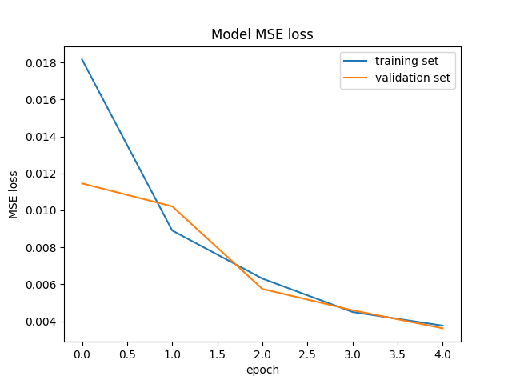

# Behavioral Cloning Project

The goals / steps of this project are the following:
* Use the simulator to collect data of good driving behavior
* Build, a convolution neural network in Keras that predicts steering angles from images
* Train and validate the model with a training and validation set
* Test that the model successfully drives around track one without leaving the road
* Summarize the results with a written report

## Model Architecture and Training Strategy

For this project I decided to use convolutional network from publication "End-to-End Deep Learning for Self-Driving Cars". It has following architecture

The only difference is Normalization layer. I used Lambda layer with equation `color / 255.0 - 0.5` for normalization and Cropping2D layer to remove some top and bottom part of input image and avoid learning of unnecessary features like sky and car. All other layers are the same as publication has (see model.py lines 56-72).

For training I used Adam optimizer to avoid manual learning rate tuning and MSE for loss function. 

All traning data was collected with provided simulator. I used following strategy:
* One lap in normal direction
* One lap in reverse direction
* All three cameras used
* Each image has left-to-right flipped pair with inverted angle (see model.py lines 80-91)

This gave me 19026 images in total (9513 records in CVS file). I used generator to avoid loading all this images in memory at once (see model.py lines 15-36). For validation I used 20% of the data.

5 epoch was used for traning and here is how traning process looks like:

After that I tried my model (see model.h5) with simulator and result was fine (see video.mp4). There were some lane crossing but car returned back to road quickly.

## Model Visualization

I was courious what features network tries to learn from input images. I used special package for Keras to visualize attention of last network layers (see visualize.html). I found that in general network tries to learn lane lines on road and use them to predict angle value. But also some wrong features were learned and I think that input data requires more preprocessing then it has now.
